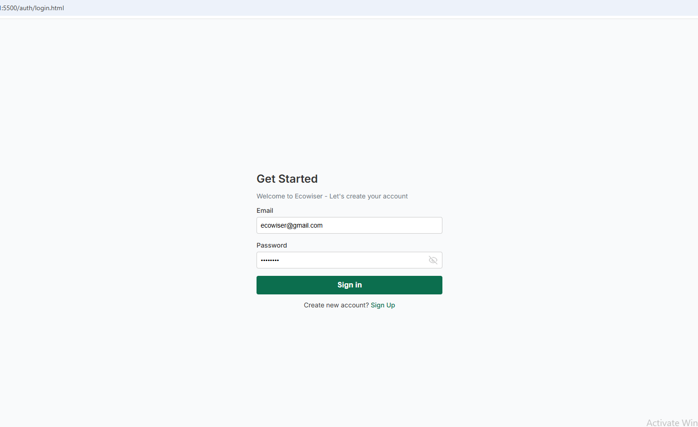

# Dashboard Project

A simple HTML, CSS, and JavaScript dashboard project with user authentication and management features.

## Access Guide

### Authentication Routes
- Login page: `http://localhost:5000/auth/login`
- Signup page: `http://localhost:5000/auth/signup`

### Dashboard Routes
- Main dashboard: `http://localhost:5000/dashboard`
- Brand management: `http://localhost:5000/dashboard/brand`
- Product management: `http://localhost:5000/dashboard/product`

## Project Structure

```
.
├── auth/
│   ├── auth.js
│   ├── login.html
│   └── signup.html
├── css/
│   ├── login.css
│   ├── signup.css
│   └── styles.css
├── dashboard/
│   ├── index.html
│   ├── brand/
│   │   ├── add-brand.html
│   │   ├── add-brand.js
│   │   ├── brands.js
│   │   ├── edit-brand.html
│   │   ├── edit-brand.js
│   │   └── styles.css
│   └── product/
│       ├── add-product.html
│       ├── add-product.js
│       ├── edit-product.html
│       ├── edit-product.js
│       ├── index.html
│       ├── script.js
│       └── styles.css
├── assets/
│   └── images/
│       └── your-images-here
└── README.md
```

## Getting Started

1. Clone or download this repository to your local machine
2. Open the project in your code editor
3. Start a local server (like Live Server in VS Code, XAMPP, or any HTTP server)
4. Access `http://localhost:5000/auth/login` in your browser

## Using Live Server (VS Code)

1. Install the "Live Server" extension in VS Code
2. Right-click on any HTML file
3. Select "Open with Live Server"
4. Your default browser will open automatically

## Adding Images

1. Place your images in the `assets/images` directory
2. Reference images in your HTML files like this:
   ```html
   
   ```

## Features

### Authentication
- User login
- User signup
- Session management

### Brand Management
- View all brands
- Add new brands
- Edit existing brands

### Product Management
- View all products
- Add new products
- Edit existing products

## Contributing

1. Fork the repository
2. Create a new branch (`git checkout -b feature/improvement`)
3. Commit your changes (`git commit -am 'Add new feature'`)
4. Push to the branch (`git push origin feature/improvement`)
5. Open a Pull Request

## License

This project is licensed under the MIT License - see the [LICENSE](LICENSE) file for details.
